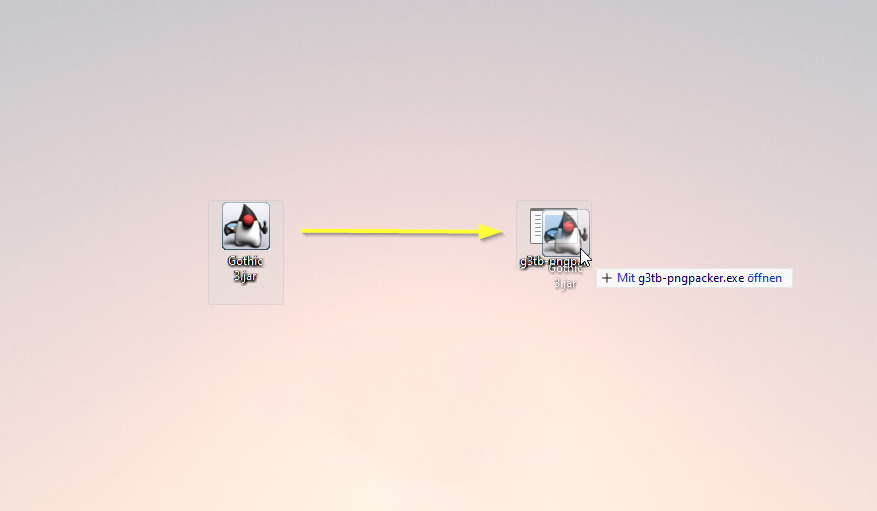
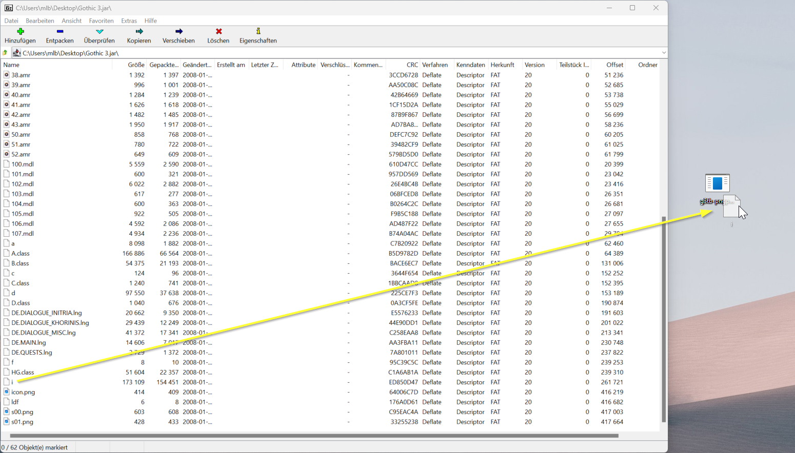
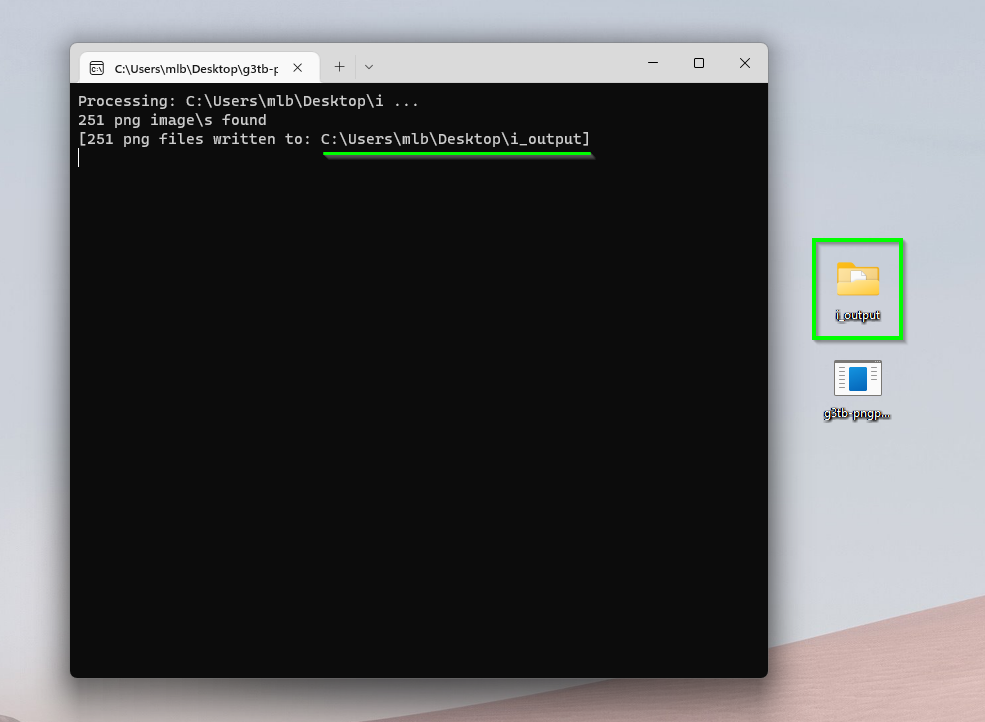
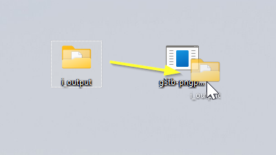
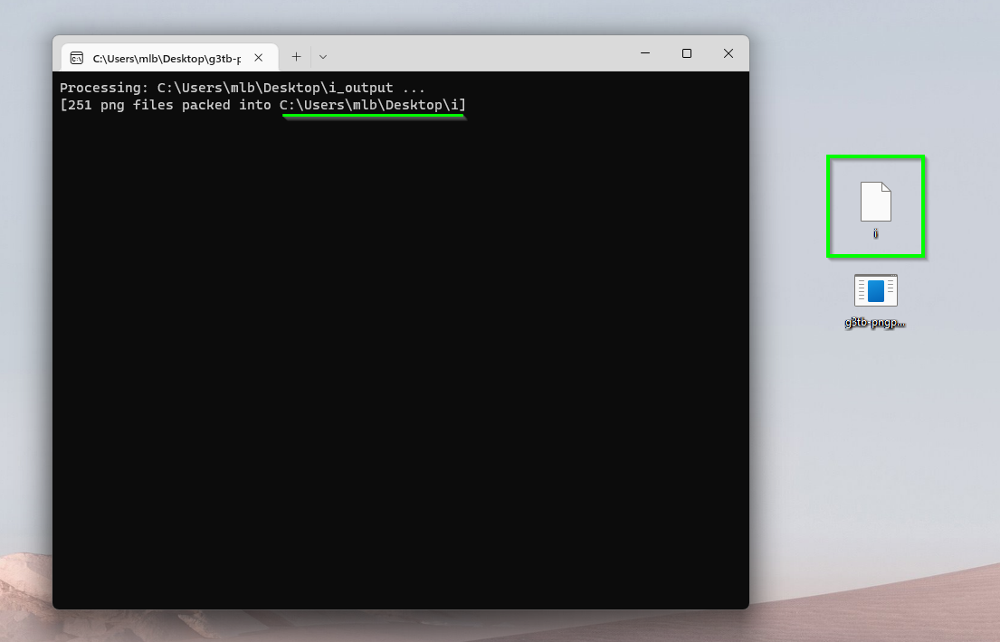
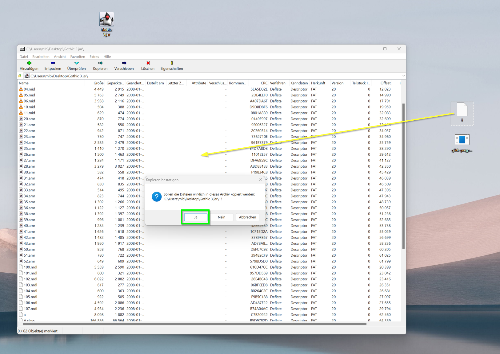

# G3TB-PngPacker
Tool for extracting and packing png images from the game Gothic 3 The Beginning

## Example
You can edit the extracted images and pack them back into the file

# How to
- clone or download this repo
- extract the zip file
- the `G3TB-PngPacker` is located in the `bin` folder

# Extracting png files from the file `i`
- open the Gothic 3 The Beginning jar file with a zip archiver program ([7zip](https://www.7-zip.de/) works perfect) and look for the file called `i`

- drag&drop the `i` file out of the jar archive
- and then drag&drop the `i` file onto the G3TB-PngPacker executable

- an output folder with the name `i_output` should be created in the same location where the G3TB-PnpPacker is located. A command line window will pop up and tell how many png images have been extracted and at what location

- in the output folder `i_output` are all the extracted png files from Gothic 3 The Beginning

# Packing the `i_output` folder with png files back into an `i` file
- drag&drop the `i_output` folder onto the G3TB-PngPacker executable

- a file called `i` will be created in the same location where the G3TB-PnpPacker is located.

# Packing the new `i` file back into the Gothic 3 The Beginning jar file
>**Warning: always back up your Gothic 3 The Beginning jar file, things could go wrong and then the jar file is corrupted and lost. I am not responsible for corrupting your jar file or anything like that**
- simply open the Gothic 3 The Beginning jar file file with 7zip and drag&drop the new `i` file into the 7zip window and confirm the popup with `Yes`.

>**************
># **IMPORTANT**

- The **order** and **count** of extracted images are important
- Do not change the filenames of the extracted png files and/or add/delete png files. The number of bytes of the `i` file must be exactly the same as the original `i` file. When you delete or add png files, the resulting file size of the `i` file will differ and this doesn't work, the game will just not load.

- The same applies when you change the filenames of the extracted png files, this will mess up the order in wich they are going to be packed into the `i` file. Again, the game will not load.

- The `i` file must have the exact name of `i` without extension, otherwise the game will not find it.
