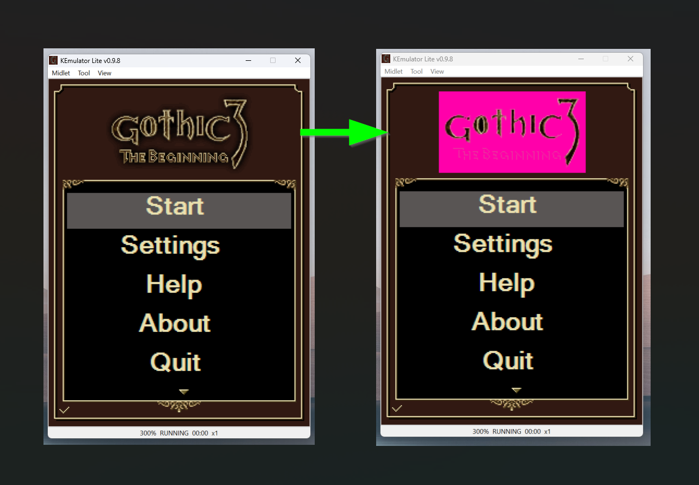
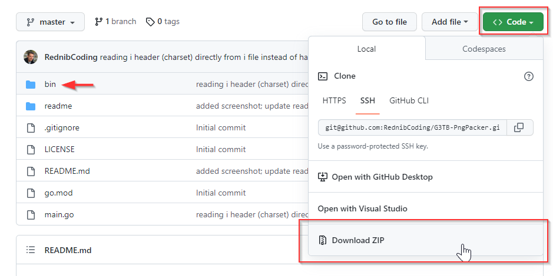

# G3TB-PngPacker
Tool for extracting and packing png images from the game Gothic 3 The Beginning

## Example
You can edit the extracted images and pack them back into the file

# How to
- clone or download this repo

## Extracting png files from the file "i"
- open the Gothic 3 The Beginning jar file with zip archiver program. For example 7zip
- within the extracted folder locate the file named "i" (this file contains all the images) in the extracted archive and drag&drop this file onto the G3TB-PngPacker executable
- an output folder with the name `i_output` should be created in the same folder where the "i" file is located, with all the extracted png files

## Packing folder with png files into an "i" file again
- backup your original "i" file
- drag&drop the folder you want to pack onto the G3TB-PngPacker executable
- a file called `i` will be created next to the "i_output" folder 
>Warning: This will overwrite the original "i" file

## Getting the new "i" file back into the jar file
- simply open (not extract) the jar file with 7zip, drag&drop the new "i" file into the 7zip window - done

>**IMPORTANT!**
**The order and number of extracted images are important**

Do not change the filenames and/or add/delete files. The number of bytes of the "i" file must be exactly the same as the original "i" file. When you delete or add files, the resulting file size of the "i" file will differ and this doesn't work, the game will just not load.

The same applies when you change the filenames, this will mess up the order in wich they are packed in the "i" file. Again, the game will not load.

The i file must have the exact name of "i" without extension, otherwise the game will not find it.