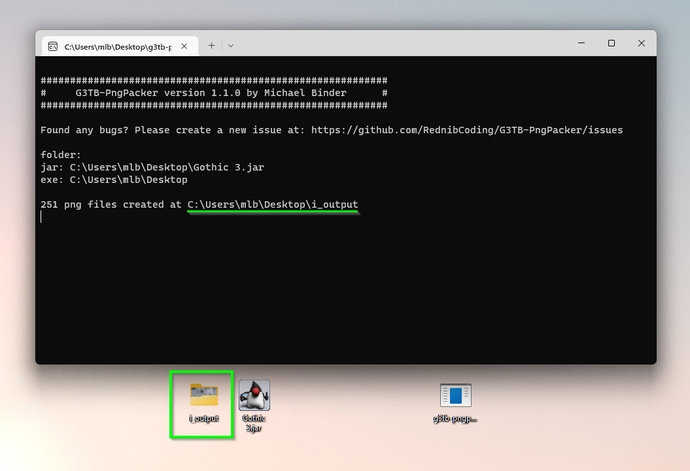

# G3TB-PngPacker
Tool for extracting and packing png images from the game Gothic 3 The Beginning

## Example
You can edit the extracted images and pack them back into the file

# How to
- clone or download this repo
- extract the zip file
- the `G3TB-PngPacker` is located in the `bin` folder

# Extracting png files from the jar file
- drag & drop the Gothic 3 The Beginning jar file onto the `G3TB-PngPacker` executable

- an output folder with the name `i_output` should be created in the same location where the jar file is located. A command line window will pop up and tell how many png images have been extracted and at what location

# Packing the `i_output` folder with png files back into the jar file
- make a backup of your jar file, if something goes wrong, the jar file will be broken irreversibly
- drag&drop both, the `i_output` **and** the Gothic 3 The Beginning jar file onto the `G3TB-PngPacker` executable

- the images are now packed back into the jar file. You can test the game now

>**************
># **IMPORTANT**

- The **order** and **count** of extracted png files are important
- Do not change the filenames of the extracted png files and/or add/delete png files. The number of bytes must be exactly the same as the original. When you delete or add png files, the resulting file size of the internal `i` file will differ and this doesn't work, the game will just not load.

- The same applies when you change the filenames of the extracted png files, this will mess up the order in wich they are going to be packed into the internal `i` file. Again, the game will not load.
